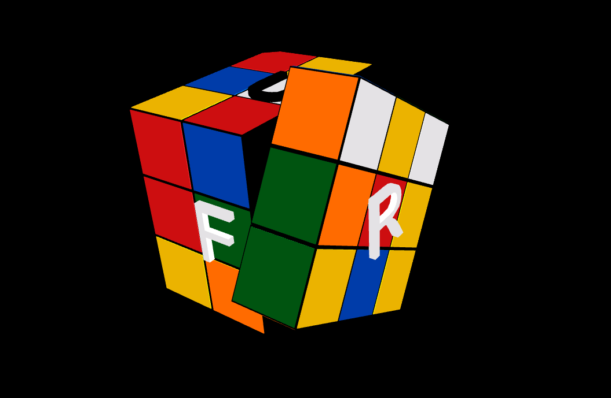

# QtCube3D

Rubik's cube in Qt/QML.



## Code Structure

### Main.qml

The cube entity is comprised of 26 CubeCells declared with side/color lists and x/y/z translation positions.

rotateCube(side, clockwise) will rotate corresponding side 90 degrees clockwise/counter-clockwise. This increases/decreases the xRotation/yRotation/zRotation of all affected CubeCells.

### CubeCell.qml

Index of CubeCells is top to bottom and left to right in the cube. 

CubeCells at the center of a side contain one color, two if on an edge, and three if on a corner.

Transformation matrix of a cube cell is defined as:

```
matrix: {
    var m = Qt.matrix4x4()
    m.rotate(xRotation, Qt.vector3d(1, 0, 0))
    m.rotate(yRotation, Qt.vector3d(0, 1, 0))
    m.rotate(zRotation, Qt.vector3d(0, 0, 1))
    m.translate(Qt.vector3d(x, y, z))
    return m
}
```

### CubeFace.qml

Single 1 unit thick cube face with x, y, z position relative to CubeCell.